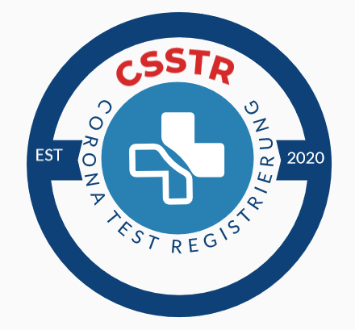

# Corona Self-Service Test Registration (CSSTR)
Register your COVID-19 drive-through test on-the-go and increase the throughput of the testing location.
This project has been developed as part of the [#WirVsVirus Hackathon](https://wirvsvirushackathon.org/) of the German federal government to fight against the coronavirus epidemic by [Tobias Müller](https://www.linkedin.com/in/tobias-m%C3%BCller-483790176/), [Stephan Fahrenkrog-Petersen](https://www.linkedin.com/in/stephan-fahrenkrog-petersen-8a2644157/) , and [Julian Theis](https://www.linkedin.com/in/julian-theis/).

This project is available as open source code; you can redistribute it and/or modify it under the terms of the GNU General Public License as published by the Free Software Foundation; either version 3 of the License, or (at your option) any later version.
This code is distributed in the hope that it will be useful, but WITHOUT ANY WARRANTY; without even the implied warranty of MERCHANTABILITY or FITNESS FOR A PARTICULAR PURPOSE. See the GNU General Public License for more details.
You should have received a copy of the GNU General Public License along with this it. If not, see [http://www.gnu.org/licenses/gpl-3.0.html](http://www.gnu.org/licenses/gpl-3.0.html).

## Description (German)
Challenge: Corona-Testprozesse: Wie optimieren wir Corona Testprozesse? (Kategorie: 020_Corona_Testprozesse)

Titel: Überwinden des "Testing Bottlenecks" (ID: 1353)

### Problem
Aktuell werden Bürgerinnen und Bürger von Haus- und Fachärzten an Corona-Untersuchungszentren (CUZ) in vielen Kreisen und Städten Deutschlands überwiesen. Die Patienten werden an den CUZ registriert und getestet. In den aktuellen Betrieben fällt auf, dass ein Bottleneck durch eine zeitaufwendige, manuelle und papierbasierte Registrierung der zu testenden Personen entsteht. Dies führt zu langen Wartezeiten und potentiellen Kapazitätsengpässen.

### Lösungsansatz
Entwicklung eines digitalen Service zur Selbst-Registrierung zu testendener Personen nach dem "Order-on-the-go"-Prinzip.

### Stakeholder
Patienten, Katastrophenschutz, Kreise und kreisfreie Städte, Kommunen, Feuerwehr, Hilfsorganisationen
